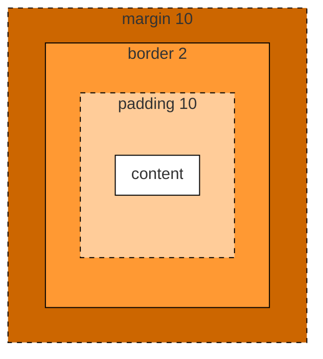
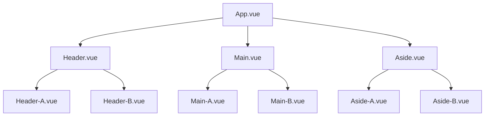

# WebFrontEndDoc

### 一、第一个前端程序

* 第一步，新建文件xxx.html

```html
<html>
    <head>
        <title>我的第一个网页</title>
    </head>
    <body>
        欢迎！
    </body>
</html>
```

> 注意事项：
>
> 1. 文件名后缀以.html结尾
>
> 2. <>必须是英文符号

* 第二步，以浏览器打开

### 二、前端工具的选择与安装

* 浏览器
* 开发者工具（vscode，安装open in browser插件可直接在IDE右键浏览器打开）

### 三、vscode快捷键

* 生成.html：!+回车
* 格式化代码：shift+Alt+F
* 向上或向下移动一行：Alt+Up或Alt+Down
* 快速复制一行代码：Shift+Alt+Up或Shift+Alt+Down
* 快速保存：Ctrl+S
* 快速查找：Ctrl+F
* 快速替换：Ctrl+H

### 四、HTML5简介与基础骨架

#### 1.HTML5介绍

HTML5是用来描述网页的一种语言，被称为超文本标记语言。用来HTML5编写的文件，后缀以.html结尾。HTML是一种标记语言，标记语言是一套标记标签。标签是由尖括号包围的关键字，例如：`<html>`

> 标签有两种表现形式：
>
> 1. 双标签，例如：`<html></html>`
> 2. 单标签，例如：``

#### 2.HTML5的DOCTYPE声明

DOCTYPE是document type（文档类型）的缩写。`<!DOCTYPE html>`是H5的声明位于文档的最前面，处于标签之前，是网页必备的组成部分，避免浏览器的怪异模式。

#### 3.HTML5基本骨架

```html
<!DOCTYPE html>
<html lang="en">
    <head>
        <meta charset="utf-8">
        <title>...</title>
    </head>
    <body>...</body>
</html>
```

##### Ⅰ.html标签

定义HTML文档，其他元素要包裹在里面，标签限定了文档的开始点和结束点

##### Ⅱ.head标签

定义文档的头部，描述了文档的各种属性和信息，包括文档的标题、在web中的位置以及和其他文档的关系等

##### Ⅲ.title标签

定义文档的标题，显示在浏览器窗口的标题栏或状态栏上，在`<head>`标签中必须包含，有利于SEO优化（搜索引擎优化）

##### Ⅳ.body标签

定义文档的主体，包含文档的所有内容（比如文本、产链接、图像、表格等等），会直接在页面中显示出来

##### Ⅴ.meta标签

单标签，描述HTML的属性，关键词等，例如：`charset="utf-8"`指当前使用的是utf-8编码格式

### 五、常用标签

#### 1.标题标签

##### Ⅰ.标题介绍与应用

标题（Heading）是通过`<h1>-<h6>`标签进行定义，其中`<h1>`定义最大的标题，`<h6>`定义最小的标题

```html
<h1>一级标题</h1>
<h2>二级标题</h2>
<h3>三级标题</h3>
<h4>四级标题</h4>
<h5>五级标题</h5>
<h6>六级标题</h6>
```

##### Ⅱ.标题标签位置

在标签中添加属性：`align="left|center|right"`，例如：`<h1 align="left">一级标题</h1>`，默认居左

#### 2.段落标签

段落通过`<p>`标签定义

```html
<p>这是一个段落</p>
<p>这是另一个段落</p>
```

#### 3.换行标签

使用`<br>`标签可以在不产生一个新段落的情况下换行

```html
<p>第一行<br>第二行</p>
```

#### 4.水平线标签

使用`<hr/>`标签创建水平线

```html
<hr color="" width="" size="" align="" />
```

> 属性：
>
> 1. color：设置水平线的颜色
> 2. width：设置水平线的长度
> 3. size：设置水平线的高度
> 4. align：设置水平线的对齐方式（默认居中）

#### 5.图片标签

使用``标签定义图像，单标签，无需闭合操作

```html

```

> 属性：
>
> 1. src：路径（图片地址与名字）
> 2. alt：图像的替代文本，当图像获取失败时显示
> 3. width：图像的宽度
> 4. heigth：图像的高度
> 5. title：鼠标悬停图像的提示

src属性支持填写绝对路径、相对路径和网络路径

##### Ⅰ.绝对路径

```html

```

##### Ⅱ.相对路径

```html

```

* 子级关系：`/`
* 父级关系：`../`
* 同级关系：`./`

##### Ⅲ.网络路径

```html

```

#### 6.超文本链接标签

使用`<a>`标签来设置超文本链接，其中超链接可以是文字或图像，使用href属性来描述链接的地址

* 文字：

```html
<a href="url">链接文本</a>
```

* 图像（内嵌图片标签实现）：

```html
<a href="url">
    
</a>
```

#### 7.文本标签

常用文本标签：

|    标签    |     描述     |
| :--------: | :----------: |
|   `<em>`   | 定义着重文字 |
|   `<b>`    | 定义粗体文本 |
|   `<i>`    |  定义斜体字  |
| `<strong>` | 定义加重语气 |
|  `<del>`   |  定义删除字  |
|  `<span>`  | 没有特定含义 |

可被其他标签嵌套使用。

#### 8.有序列表标签

有序列表是一列项目，列表项目使用数字进行标记。有序列表始于`<ol>`标签，每个项始于`<li>`标签

```html
<ol type="1">
    <li>xxx</li>
    <li>xxx</li>
</ol>
```

* `<ol>`标签属性type的选项：1，a，A，i，I

* 有序列表可以嵌套

#### 9.无序列表标签

无序列表是一列项目，使用粗体圆点进行标记。无序列表始于`<ul>`标签，每个项始于`<li>`标签

```html
<ul type="disc">
    <li>xxx</li>
    <li>xxx</li>
</ul>
```

* `<ul>`标签属性type的选项：disc（默认，实心圆），circle（空心圆），square（小方块），none（不显示）
* 无序列表可以嵌套

#### 10.表格标签

> 表格组成与特点：
>
> 1. 行
>
> 2. 列
>
> 3. 单元格（同行等高、同列等宽）

* 表格标签：`<table>`

* 行标签：`<tr>`

* 单元格（列）标签：`<td>`

```html
<table>
    <tr>
        <td>1</td>
        <td>2</td>
    </tr>
    <tr>
        <td>3</td>
        <td>4</td>
    </tr>
    <tr>
        <td>5</td>
        <td>6</td>
    </tr>
</table>
```

> 表格属性：
>
> 1. border：设置表格的边框
> 2. width：设置表格的宽度
> 3. height：设置表格的高度

单元格合并属性：

* 水平合并（保留左边，删除右边）：colspan
* 垂直合并（保留上边，删除下边）：rowspan

```htm
<table>
    <tr>
        <td colspan="2">1</td>
    </tr>
    <tr>
        <td>3</td>
        <td rowspan="2">4</td>
    </tr>
    <tr>
        <td>5</td>
    </tr>
</table>
```

### 六、Form表单

表单在web网页中用来给用户填写信息，比如登录注册、搜索框等，使网页具有交互功能

表单由容器和控件组成。一个表单一般包含输入框，提交按钮等。表单就是容器，输入框和按钮等就是控件

```html
<form action="url" method="get|post" name="myform"></form>
```

> 属性说明：
>
> 1. action：服务器地址
> 2. name：表单名称
> 3. methd：请求方法

#### 1.表单标签

`<form></form>`

#### 2.表单域

* 文本框，通过`<input type="text">`标签设定
* 密码框，通过`<input type="pasword">`标签设定，内容不会明文显示

#### 3.表单按钮

`<input type="submit">`

```html
<form>
    <input type="text">
    <input type="submit" value="提交">
</form>
```

### 七、块元素与行内元素（内联元素）

内联元素和块级元素的区别：

|                   块级元素                   |                   内联元素                   |
| :------------------------------------------: | :------------------------------------------: |
| 块元素会在页面中独占一行（自上向下垂直排列） | 行内元素不会独占页面中的一行，只占自身的大小 |
|          可以设置width，height属性           |      行内元素设置width，height属性无效       |
|  一般块级元素可以包含行内元素和其他块级元素  |    一般内联元素包含内联元素不包含块级元素    |

> 常见块级元素：
>
> div、form、h1~h6、hr、p、table、ul等

> 常见内联元素：
>
> a、b、em、i、span、strong等

> 行内块级元素（特点：不换行、能够识别宽高）：
>
> button、img、input等

> HTML5新标签：
>
> 1. `<header></header>`头部
> 2. `<nav></nav>`导航
> 3. `<section></section>`定义文档中的节，比如章节、页尾、页脚
> 4. `<aside></aside>`侧边栏
> 5. `<footer></footer>`脚部
> 6. `<article></article>`代表一个独立的、完整的相关内容块，例如一篇文章，一个评论等

### 八、CSS

#### 1.概念

CSS（Cascading Style Sheets） 层叠样式表，又叫级联样式表，简称样式表

CSS用于HTML文档中元素的央视定义，文件后缀名为.css

#### 2.语法

CSS规则由两个主要的部分构成：选择器，以及一条或多条的声明（样式）

```css
/*选择器*/  /*声明1，属性:值;*/  /*声明2，属性:值;*/
h1         {color:blue;     font-size:12px;}
```

* 选择器：HTML元素
* 声明：由一个样式属性（style attribute）和一个值组成

#### 3.加载方式

##### Ⅰ.内联样式（行内样式）

标签内使用样式（style）属性

```html
<p style="background:orange;font-size:24px;">CSS</p>
```

> 缺点：
>
> 缺乏整体性和规划性，维护成本高

##### Ⅱ.内部样式

当单个文档需要特殊的样式时，可使用内部样式表，使用`<style>`标签在文档头部定义

```html
<head>
    <style>
        h1{background:red;}
    </style>
</head>
```

> 缺点：
>
> 单个页面内的CSS代码便于维护，但是多个页面之间容易混乱

##### Ⅲ.外部样式

当样式需要应用于多个页面时，可以通过改变一个文件来改变所有样式。页面在头部使用`<link>`标签链接到样式表

```html
<link rel="stylesheet" type="text/css" href="xxx.css">
```

#### 4.选择器

##### Ⅰ.全局选择器

与任何元素匹配，优先级最低

```css
*{margin:0;padding:0}
```

##### Ⅱ.元素选择器

HTML文档中的元素，p、b、div、a、img、body等。作用于页面上所有这种标签

```css
p{font-size:14px;}
```

##### Ⅲ.类选择器

用圆点.前缀来定义

```html
<h2 class="classone">你好</h2>
```

```css
.classone{width:800px;}
```

同一个标签可以用多个类选择器，多次定义或用空格隔开

```html
<h3 class="classone classtwo">你好</h3>
<h3 class="classone" class="classtwo">你好</h3>
```

> 注意：
>
> 1. 类名不能以数字开头
> 2. 类选择器可以被多种标签使用

##### Ⅳ.ID选择器

用井号#前缀来定义，只能使用一次

```html
<h2 id="myid">你好</h2>
```

```css
#myid{border:3px;}
```

> 注意：
>
> 1. ID不能以数字开头
> 2. ID是唯一的

##### Ⅴ.合并选择器

提起共同的样式，减少重复代码

```css
.header, .footer{height:300px;}
```

#### 5.选择器的优先级

元素选择器权重：1

类选择器权重：10

ID选择器权重：100

内联样式权重：1000

优先级从高到低：内联样式>ID选择器>类选择器>元素选择器

#### 6.字体属性

##### Ⅰ.color

规定文本的颜色

```css
div{color:red;}
```

##### Ⅱ.font-size

设置文本的大小

```css
p{font-size:14px;}
```

##### Ⅲ.font-weight

设置文本的粗细

```css
p{font-weight:900;}
```

| 值      | 描述                               |
| ------- | ---------------------------------- |
| bold    | 定义粗体字符                       |
| bolder  | 定义更粗的字符                     |
| lighter | 定义更细的字符                     |
| 100~900 | 定义由细到粗，默认400，bold等于700 |

##### Ⅳ.font-style

文本的字体样式

```css
p{font-style:italic;}
```

| 值     | 描述       |
| ------ | ---------- |
| normal | 默认值     |
| italic | 定义斜体字 |

##### Ⅴ.font-family

指定一个元素的字体

```css
p{font-family:"Microsoft YaHei";}
```

#### 7.背景属性

| 属性                | 描述                 |
| ------------------- | -------------------- |
| background-color    | 设置背景颜色         |
| background-image    | 设置背景图片         |
| background-position | 设置背景图片显示位置 |
| background-repeat   | 设置背景图片如何填充 |
| background-size     | 设置背景图片大小属性 |

##### Ⅰ.background-color

设置背景颜色

```css
div{background-color:red;}
```

##### Ⅱ.background-image

设置背景图像，默认平铺

```css
div{background-image:url("images/1.jpg");}
```

##### Ⅲ.background-position

设置背景图像的起始位置，默认值：0% 0%

| 值            | 说明                                                         |
| ------------- | ------------------------------------------------------------ |
| left top      | 左上角                                                       |
| left center   | 左 中                                                        |
| left bottom   | 左 下                                                        |
| right top     | 右上角                                                       |
| right center  | 右 中                                                        |
| right bottom  | 右 下                                                        |
| center top    | 中 上                                                        |
| center center | 中 中                                                        |
| center bottom | 中 下                                                        |
| x% y%         | 第一个值是水平位置，第二个值是垂直位置，左上角是0% 0%，右下角是100% 100%。如果只指定了一个值，其他值默认是50%。默认是0% 0% |
| xpos ypos     | 单位是像素                                                   |

```css
div{background-position:center center;}
```

##### Ⅳ.background-repeat

设置如何平铺背景图像

| 值        | 说明             |
| --------- | ---------------- |
| repeat    | 默认值           |
| repeat-x  | 只向水平方向平铺 |
| repeat-y  | 只向垂直方向平铺 |
| no-repeat | 不平铺           |

```css
div{background-repeat:no-repeat;}
```

##### Ⅴ.background-size

设置背景图像的大小

| 值         | 说明                                                         |
| ---------- | ------------------------------------------------------------ |
| length     | 设置背景图片的宽度和高度，第一个值宽度，第二个值高度，如果只是设置一个，第二个值auto |
| percentage | 计算相对位置区域的百分比，第一个值宽度，第二个值高度，如果只是设置一个，第二个值auto |
| cover      | 保持图片纵横比并将图片缩放成完全覆盖背景区域的最小大小       |
| contain    | 保持图片纵横比并将图片缩放成适合背景定位区域的最大大小       |

```css
div1{background-size:1200px 1200px;}
div2{background-size:100% 100%;}
div2{background-size:cover;}
div2{background-size:contain;}
```

#### 8.文本属性

##### Ⅰ.text-align

指定元素文本的水平对齐方式

| 值     | 描述             |
| ------ | ---------------- |
| left   | 文本居左，默认值 |
| right  | 文本居右         |
| center | 文本居中         |

```css
p{text-align:center;}
```

##### Ⅱ.text-decoration

指定文本修饰，下划线、上划线、删除线等

| 值           | 描述   |
| ------------ | ------ |
| underline    | 下划线 |
| overline     | 上划线 |
| line-through | 删除线 |

```css
p{text-decoration:underline;}
```

##### Ⅲ.text-transform

控制文本的大小写

| 值         | 描述                 |
| ---------- | -------------------- |
| captialize | 每个单词开头大写字母 |
| uppercase  | 全部大写字母         |
| lowercase  | 全部小写字母         |

```css
p{text-transform:captialize;}
```

##### Ⅳ.text-indent

指定元素中首行文本的缩进，负数则向左缩进

```css
p{text-indent:50px;}
```

#### 9.表格属性

##### Ⅰ.border

指定表格边框

```css
table,td{border:1px solid black;}
```

##### Ⅱ.border-collapse

指定折叠边框，表格的边框是否被折叠成一个单一的边框或隔开

```css
table{border-collapse:collapse;}
```

##### Ⅲ.width和height

指定表格的宽度和高度

```css
table{width:100px;height:50px;}
```

##### Ⅳ.text-align和vertical-align

指定表格中的文本水平对齐和垂直对齐

```css
td1{text-align:right}
td2{vertical-align:bottom;}
```

##### Ⅴ.padding

控制表内容与边框之间的距离

```css
td{padding:15px;}
```

##### Ⅵ.backgound-color

指定文本的背景颜色

```css
td{backgound-color:greeen;}
```

#### 10.关系选择器

##### Ⅰ.后代选择器

选择所有被E元素包含的F元素，中间用空格隔开

```css
E F{...}
```

##### Ⅱ.子代选择器

选择所有作为E元素的直接子元素F，对更深一层的元素不起作用，用>表示

```css
E>F{...}
```

##### Ⅲ.相邻兄弟选择器

选择紧跟E元素后的F元素，即相邻随后的第一个兄弟元素

```css
E+F{...}
```

##### Ⅳ.通用兄弟选择器

选择E元素之后的所有兄弟元素F

```css
E~F{...}
```

#### 11.盒子模型（box model）

所有的HTML元素可以看作盒子，在CSS中，用来设计和布局时使用，封装周围的HTML元素

其中包括：外边距（margin）、边框（border）、内边距（padding）和内容（content）



##### Ⅰ.margin（外边距）

清除边框外的区域，外边距是透明的（两个值：第一个值指定上下，第二个值指定左右，也可通过left、right、top、bottom属性分别指定）

##### Ⅱ.border（边框）

围绕在内边距和内容外的边框

##### Ⅲ.padding（内边距）

清楚内容周围的区域，内边距是透明的（两个值：第一个值指定上下，第二个值指定左右，，也可通过left、right、top、bottom属性分别指定）

##### Ⅳ.content（内容）

盒子的内容，显示文本和图像

```css
div{margin:20px;padding-left:30px;}
```

#### 12.弹性盒子模型（flex box）

弹性盒子是CSS3的一种新布局模式，是当页面需要适应不同屏幕大小时确保元素拥有恰当的行为的布局方式

弹性盒子由弹性容器（Flex container）和弹性子元素（Flex item）组成，通过设置`display`属性的值为`flex`定义为弹性容器，可包含一个或多个弹性子元素

> 注意：
>
> 1. 弹性容器外以及弹性子元素内是正常渲染，弹性盒子只定义了弹性子元素如何在弹性容器内布局
> 2. 弹性盒子里面默认横向摆放

##### Ⅰ.父元素属性

###### i.display属性

开启弹性盒子模式

```css
div{display:flex;}
```

###### ii.flex-direction属性

指定弹性子元素在容器中的位置

* row：左对齐，默认
* row-reverse：右对齐
* column：纵向排列
* column-reverse：反转纵向排列，从下往上排

```css
div{display:flex;flex-direction:column;}
```

###### iii.justify-content属性

弹性项沿着弹性容器的主轴线（main axis）对齐

* flex-start：靠上摆放，默认
* flex-end：靠下摆放
* center：居中摆放

```css
div{display:flex;flex-direction:column;justify-content:flex-start;}
```

###### iv.align-items属性

弹性项沿着侧轴（纵轴）对齐

* flex-start：居左对齐，默认
* flex-end：居右对齐
* center：居中对齐

```css
div{display:flex;flex-direction:column;align-items:flex-start;}
```

##### Ⅱ.子元素属性

###### i.flex-grow/flex

根据弹性盒子元素所设置的扩展因子作为比率来分配剩余空间。默认0，即若存在剩余空间，也不放大

```css
div div1{flex:2;}
div div2{flex:2;}
div div3{flex:1;}
```

#### 13.浮动

float属性定义元素往哪个方向浮动，只有左右浮动

| 值    | 描述     |
| ----- | -------- |
| left  | 向左浮动 |
| right | 向右浮动 |

> 注意：
>
> 1. 浮动以后元素脱离标准流（文档流），相当于在页面上面增加一个浮层来放置内容。可以理解为有两层页面，一层是底层的原页面，一层是脱离文档流的上层页面，所以会出现折叠现象
> 2. 若元素A是浮动的，如果A的上一个元素也是浮动，那么A会跟随上一个元素的后边（当容器不足以横向摆放时，会摆放到下一行）；如果A的上一个元素是标准流中的元素，那么A的相对垂直位置不会改变，即是A的顶部总是和上一个元素的底部对齐

```css
div{float:left;}
```

#### 14.清除浮动

> 浮动的副作用：
>
> 1. 浮动元素会造成父元素高度塌陷（相当于内容丢失）
> 2. 后续元素会收到影响

当父元素出现塌陷时，不利于后续布局，因此必须清除副作用，解决方案有多种

##### Ⅰ.父元素设置高度

给父元素设置高度，撑开元素本身大小

##### Ⅱ.受影响的元素增加clear属性

属性只影响本身元素，不影响其他元素

```css
/*left:左边不允许出现浮动元素, right：右边不允许出现浮动元素, both：左右两边不允许出现浮动元素*/
div{clear:both;}
```

##### Ⅲ.overflow清除浮动

父级标签样式加：`overflow:hidder;clear:both;`

```css
div{overflow:hidder;clear:both;}
```

##### Ⅳ.伪对象方式

父级标签不能设置高度，增加伪类`after`，设置空的内容，并且使用`dispaly:block;clear:both;`

```css
div::after{content:"";dispaly:block;clear:both;}
```

#### 15.定位

`position`属性指定元素的定位类型

| 值       | 描述                             |
| -------- | -------------------------------- |
| relative | 相对定位                         |
| absolute | 绝对定位，会脱离标准流（文档流） |
| fixed    | 固定定位，会脱离标准流（文档流） |

设置定位后，可以使用四个方向值进行位置调整：`left`、`top`、`right`、`bottom`

```css
div{position:relative;left:200px;top:100px;}
```

> 注意：相对定位和绝对定位是相对于具有定位的父级元素进行位置调整，若父级元素不存在，则继续向上逐级寻找，直到顶层文档

* `z-index`属性设置元素的堆叠顺序，更高的元素堆叠在前

```css
div1{position:absolute;z-index:1;}
div2{position:absolute;z-index:2;}
```

#### 16.圆角

`border-radius`指定元素圆角

> 值规则：
>
> 1. 四个值：第一个值为左上角，第二个值为右上角，第三个值为右下角，第四个值为左下角
> 2. 三个值：第一个值为左上角，第二个值为右上角和左下角，第三个值为右下角
> 3. 两个值：第一个值为左上角与右下角，第二个值为右上角与左下角
> 4. 一个值：四个圆角值相同
> 5. 100%则为圆形

#### 17.阴影

`box-shadow`指定元素一个或多个阴影

| 值       | 描述                 |
| -------- | -------------------- |
| h-shadow | 必选，水平阴影的位置 |
| v-shadow | 必选，垂直阴影的位置 |
| blur     | 可选，模糊距离       |
| color    | 可选，阴影的颜色     |

```css
div{box-shadow:10px 10px 20px rgba(0,0,0,0.5);}
```

#### 18.动画

动画是使元素从一种样式逐渐变化为另一种样式的效果

用百分比来规定变化发生的时间，或用关键词`from`和`to`，等同于0%和100%，0%是动画开始，100%是动画完成

* `@keyframes`指定元素的动画规则

```css
/*name是动画名称, 自定义; ...编写css样式代码*/
@keyframes name1 {
    from{...}
    to{...}
}
```

```css
@keyframes name2 {
    0%{...}
    50%{...}
    100%{...}
}
```

* animation执行动画

| 值                   | 描述                                                         |
| -------------------- | ------------------------------------------------------------ |
| name                 | 指定使用的动画名称                                           |
| duration             | 设置动画的持续时间                                           |
| timing-function      | 设置动画效果的速率：`ease`逐渐变慢（默认），`linear`匀速，`ease-in`加速，`ease-out`减速，`ease-in-out`先加速后减速 |
| delay                | 设置动画的开始时间（延时执行）                               |
| iteration-count      | 设置动画循环的次数，`infinite`为无限次数                     |
| direction            | 设置动画播放的方向：`normal`正向（默认），`alternate`偶数次正向奇数次反向 |
| animation-play-state | 控制动画的播放状态：`running`播放，`paused`停止              |

```css
/*规则：
animation: name duration timing-function delay iteration-count direction;
*/
div{
    animation: name 3s linear 0s infinite;
}
/*鼠标悬停停止动画*/
div:hover{
    animation-play-state:paused;
}
```

#### 19.媒体查询

媒体查询会根据设备的大小自动识别加载不同的样式

* 设置meta标签

使用设备的宽度作为视图宽度并禁止初始的缩放

```html
<meta name="viewport" content="width=device-width,initial-scale=1,maximum-scale=1,user-scalable=no">
```

> 参数解释：
>
> 1. `width=device-width`宽度等于当前设备的宽度
> 2. `initial-scale`初始的缩放比例（默认1.0）
> 3. `maximum-scale`允许用户缩放到的最大比例（默认1.0）
> 4. `user-scalable`用户是否可以手动缩放（默认no）

* 设置media样式

```css
@media screen and (max-width:768px){
    div{...}
}
@media screen and (min-width:768px) and (max-width:996px){
    div{...}
}
@media screen and (min-width:996px){
    div{...}
}
```

#### 20.雪碧图

CSS Sprite也叫CSS精灵图、CSS雪碧图，允许将一个页面涉及到的所有零星图片都包含到一张大图中。可以减少网络传输次数，从而提高性能

> 原理：
>
> 1. 通过`background-image`引入背景图片
> 2. 通过`background-position`把背景图片移动到所需位置

```css
span{
    width:50px;
    height:50px;
    background-image:url(1.png);
    background-position:-10px -10px;
}
```

#### 21.字体图标

使用字体图标来代替图标图片

> 优点：
>
> 1. 轻量性：加载速度快，减少http请求
> 2. 灵活性：利用CSS设置大小颜色等
> 3. 兼容性：一般受到所有浏览器支持

常用字体图标库：[阿里字体突变库](https://iconfont.cn/)

下载字体图标代码后通过样式`link`引用

### 九、JavaScript

#### 1.介绍

JavaScript是一种嵌入式的脚本语言

#### 2.JavaScript与ECMAScript的关系

ECMAScript是规范，JavaScript是实现

#### 3.语句、标识符

##### Ⅰ.语句

语句以分号或换行结尾，一个分号或换行就表示一个语句结束

```javascript
var num = 10;
```

##### Ⅱ.标识符

标识符是由：字母、美元符号（$），下划线（_）和数字组成，不能以数字开头，JavaScript的保留关键字不能用作标识符

#### 4.变量提升

JavaScript引擎是先解析代码，获取所有被声明的变量再运行。因此所有变量的声明语句，都会被提升到代码的头部，这就叫做变量提升（hoisting）

```java
console.log(num);/*不报错，但输出undefined*/
var num = 10;
```

等同于

```javascript
var num;
console.log(num);/*不报错，但输出undefined*/
num = 10;
```

#### 5.JavaScript引入

##### Ⅰ.嵌入到HTML文件中

```html
<body>
    <script>
      var age = 20;
    </script>
</body>
```

#### Ⅱ.引入本地独立JS文件

```html
<head>
    <script type="text/javascript" scr="./1.js"></script>
</head>
```

#### Ⅲ.引入网络来源文件

```html
<head>
    <script src="http://code.jquery.com/jquery1.2.1.min.js"></script>
</head>
```

#### 6.注释

* 单行注释，用`//`

```javascript
// 单行注释
```

* 多行注释，用`/*...*/`

```javascript
/*
多行注释
*/
```

#### 7.输出方式

```javascript
/*三种方式*/
alert("弹出提示框");
document.write("写入网页中");
console.log("写入控制台");
```

#### 8.数据类型

JavaScript共有六种数据类型（ES6新增第七种`Symbol`和第八种`BigInt`）

##### Ⅰ.原始类型（基础类型）

数值、字符串、布尔值

```javascript
var age = 20;// 数值
var name = "名称";// 字符串
var learn = true;// 布尔值
```

##### Ⅱ.合成类型（复合类型）

对象（object），多个原始类型的值的合成

```javascript
var user = {
    name:"名称",
    age:20,
    learn:true
}
```

> 注意：
>
> `undefined`和`null`一般看成两个特殊值

##### Ⅲ.typeof

`typeof`确定一个值是什么类型

```javascript
typeof 123;// "number"
typeof '123';// "string"
typeof false;// "boolean"
typeof {};// "object"
```

#### 9.运算符

##### Ⅰ.加/减/乘/除运算符

```javascript
10+10;
10-10;
10*2;
10/5;
```

##### Ⅱ.余数运算符

```javascript
13%5;
```

##### Ⅲ.自增/自减运算符

```javascript
var x = 1;
var y = 1;
++x;
x++;
--y;
y--;
```

> 注意：自增/自减运算符放在变量前，则先进行运算操作，再返回值；放在变量后，则先返回值，再进行运算操作

##### Ⅳ.赋值运算符

| 运算符 |       表达式        |
| :----: | :-----------------: |
|   =    |     赋值运算符      |
|   +=   | `x+=y`等同于`x=x+y` |
|   -=   | `x-=y`等同于`x=x-y` |
|   *=   | `x*=y`等同于`x=x*y` |
|   /=   | `x/=y`等同于`x=x/y` |
|   %=   | `x%=y`等同于`x=x%y` |

##### Ⅴ.比较运算符

| 比较运算符 |               描述               |
| :--------: | :------------------------------: |
|     <      |            小于运算符            |
|     >      |            大于运算符            |
|     <=     |         小于或等于运算符         |
|     >=     |         大于或等于运算符         |
|     ==     |            相等运算符            |
|    ===     |  严格相等运算符（比较值和类型）  |
|     !=     |           不相等运算符           |
|    !==     | 严格不相等运算符（比较值和类型） |

##### Ⅵ.布尔运算符

###### i.取反运算符（!）

* 布尔值取反

```javascript
!true; // false
!false; //true
```

* 非布尔值取反

```javascript
/*以下六个值取反后为true，其他值都为false*/
!undefined //true
!null //true
!0 //true
!NaN //true
!"" //true
!false //true
```

###### ii.且运算符

所有条件满足为true，否则false

```javascript
true&&true;// true
true&&false;// false
```

###### iii.或运算符

只要满足一个条件为true，所有都不满足为false

```javascript
true||false;// true
false||false;// false
```

##### Ⅶ.三元运算符

运算符需要三个运算子

```javascript
/*条件？表达式1:表达式2*/
var num = 11;
num % 2 === 0 ? console.log("偶数") : console.log("奇数");
```

#### 10.条件语句

##### Ⅰ.if..else...语句

根据表达式的真伪执行不同的语句

```javascript
var m = 3;
if(m===3){
    ...
}else if(m===2){
    ...
}else{
    ...
}
```

##### Ⅱ.switch语句

可以简化某些if...else...语句

```javascript
var m = 3;
switch(m){
    case 3:
        ...
        break;
    case 2:
        ...
        break;
    default:
        ...
}
```

> 注意：每个case块内的break语句不可少，否则不会跳出switch，而会接下去执行下一个case代码块

#### 11.循环语句

##### Ⅰ.for

for语句指定循环的起点、终点和终止条件来执行循环命令

```javascript
/*
for(初始化表达式;布尔表达式;迭代因子){
    ...
}
*/
for(var i=1;i<100;i++){
    ...
}
```

* 初始化表达式（initialize）：确定循环变量的初始值，只在循环开始时执行一次

* 布尔表达式（test）：每轮循环开始都执行，值为真才继续循环
* 迭代因子（increment）：每轮循环的最后一个操作，通常用来递增循环变量

##### Ⅱ.while

while语句指定循环条件和代码块，只要条件为真，就不断循环执行

```javascript
/*
while(条件){
    ...
}
*/
var i = 1;
while(i<100){
    i++;
}
```

##### Ⅲ.break

break用于跳出代码块或循环

```javascript
for(var i=0;i<5;i++){
    if(i===3){
        break;
    }
}
```

##### Ⅳ.continue

continue用于终止本轮循环，开始下一轮循环

```javascript
for(var i=0;i<5;i++){
    if(i===3){
        continue;
    }
}
```

#### 12.字符串

字符串就是零个或多个排在一起的字符，放在单引号或双引号之中

```javascript
'abc'
"abc"
```

如果要在单引号内部使用单引号，或者双引号内部使用双引号，就需要在引号前面加上反斜杠，表示转义

```javascript
'ab\'c'
"ab\"c"
```

字符串默认只能写在一行内，分成多行需要在每行结尾使用反斜杠

```javascript
var str = 'ab\
c';
```

##### Ⅰ.length属性

length属性返回字符串的长度

```javascript
var str = "abc";
str.length;// 3
```

##### Ⅱ.charAt()

charAt方法返回指定位置的字符，参数是从0开始编号，如果参数为负数或者大于等于字符串长度，则返回空字符串

```javascript
var str = new String('abc');
str.charAt(1);// "b"
str.charAt(-1);// ""
str.charAt(9);// ""
```

##### Ⅲ.concat()

concat方法用于连接两个字符串

```javascript
var str1 = 'abc';
var str2 = 'def';
var str3 = str1.concat(str2);
console.log(str3);// "abcdef"
```

接受多个参数

```javascript
'a'.concat('b','c');// "abc"
```

如果参数不是字符串，会转为字符串连接

```javascript
''.concat(1,2,'3');// "123"
```

##### Ⅳ.substring()

substring方法用于从原字符串取出子字符串并返回，第一个参数表示开始位置（从0开始），第二个参数表示结束位置（返回结果不含该位置）

```javascript
'abc'.substring(0,2);// "ab"
```

如果第二个参数省略，则一直到结束

```javascript
'abc'.substring(0);// "abc"
```

如果第一个参数大于第二个参数，则会自动更换两个参数的位置

```javascript
'abc'.substring(2,0);// 等同于'abc'.substring(0,2)
```

如果参数是负数，则会自动转为0

```javascript
'abc'.substring(-1,2);// 等同于'abc'.substring(0,2)
```

##### Ⅴ.substr()

substr方法用于从原字符串取出子字符串并返回，第一个参数表示开始位置（从0开始），第二个参数表示截取长度

```javascript
'abc'.substr(0,1);// "a"
```

如果第二个参数省略，则一直到结束

```javascript
'abc'.substr(0);// "abc"
```

如果第一个参数是负数，则表示倒数计算字符位置；如果第二个参数是负数，则会自动转为0，返回空字符串

```javascript
'abc'.substr(-2,1);// "b"
```

##### Ⅵ.indexOf()

indexOf方法用于查找一个字符串在另一个字符串中第一次出现的位置，不匹配则返回-1

```javascript
'abc'.indexOf('c');// 2
'abc'.indexOf('efg');// -1
```

第二个参数表示从该位置开始向后匹配

```javascript
'abc'.indexOf('c',1);// 2
```

##### Ⅶ.trim()

trim方法用于去除字符串两端的空格，包括制表符（`\t`、`\v`）、换行符（`\n`）和回车符（`\r`）

```javascript
'\r\n abc\t'.trim();// "abc"
```

在ES6中还支持trimStart()和trimEnd()方法，代表只去除开头和结尾

##### Ⅷ.split()

split方法按照给定规则分割字符串，返回一个数组

```javascript
'a|b|c'.split('|');// ["a","b","c"]
```

如果参数为空字符串。则返回每一个字符

```javascript
'a|b|c'.split('');// ["a","|","b","|","c"]
```

如果参数省略，则返回数组并且唯一成员是原字符串

```javascript
'a|b|c'.split();// ["a|b|c"]
```

第二个参数表示返回数组的最大成员数

```javascript
'a|b|c'.split('|',0);// []
'a|b|c'.split('|',1);// ["a"]
```

#### 13.数组

数组（array）是按次序排列的一组值，每个值的位置都有编号（从0开始），整个数组用方括号表示

```javascript
var arr = ['abc','def','ghi'];
```

除了定义时赋值，也可以先定义后赋值

```javascript
var arr = [];
arr[0] = 'abc';
arr[1] = 'def';
arr[2] = 'ghi';
```

任何类型的数据都可以放入数组

```javascript
var arr = [10,[1,2,3],false];
```

如果数组的元素还是数组，就形成多维数组

```javascript
var a = [[1,2],[3,4]];
a[0][1];// 2
a[1][1];// 4
```

##### Ⅰ.length属性

length属性返回数组的成员数量

```javascript
['abc','def','ghi'].length;// 3
```

##### Ⅱ.遍历

###### i.for

```javascript
var arr = ['abc','def','ghi'];
for(var i = 0; i < arr.length; i++){
    console.log(a[i]);
}
```

###### ii.while

```javascript
var arr = ['abc','def','ghi'];
var i = 0;
while(i < arr.length){
    console.log(a[i]);
    i++;
}
```

###### iii.for...in...

```javascript
var arr = ['abc','def','ghi'];
for(var i in arr){
    console.log(arr[i]);
}
```

##### Ⅲ.Array.isArray()

Array.isArray静态方法判断是否为数组

```javascript
var arr = ['abc','def','ghi'];
Array.isArray(arr);// true
```

##### Ⅳ.push()/pop()

push方法用于在数组末端添加一个或多个元素，并返回新数组的长度

```javascript
var arr = [];
arr.push('abc');// 1
```

pop方法用于删除数组的最后一个元素，并返回该元素

```javascript
var arr = ['abc','def','ghi'];
arr.pop();// 'ghi'
arr; // ['abc','def']
```

##### Ⅴ.shift()/unshift()

shift方法用于删除数组的第一个元素，并返回该元素

```javascript
var arr = ['abc','def','ghi'];
arr.shift();// 'abc'
arr; // ['def','ghi']
```

使用shift可遍历数组并清空

```javascript
var arr = ['abc','def','ghi'];
var item;
while(item = arr.shift()){
    console.log(item);
}
arr //[]
```

unshift方法用于在数组第一个位置添加元素，并返回数组长度

```javascript
var arr = ['abc'];
arr.unshift('def');// 2
arr.unshift('ghi','jkl');// 4
arr // ['abc','def','ghi','jkl']
```

##### Ⅵ.join()

join方法用于将数组成员连接为一个字符串，如果不提供参数，默认用逗号

```javascript
var arr = ['abc','def','ghi'];
a.join();// "abc,def,ghi"
a.join(' ');// "abc def ghi"
```

如果数组成员是`undefined`或`null`或空位，则会被转成空字符串

##### Ⅶ.concat()

concat方法用于多个数组的合并

```javascript
['abc','def'].concat(['ghi'],['jkl']);// ['abc','def','ghi','jkl']
```

##### Ⅷ.reverse()

reverse方法用于颠倒排列数组元素

```javascript
['abc','def','ghi'].reverse();// ['ghi','def','abc']
```

反转字符串

```javascript
"abc".split("").reverse().join("");// "cba"
```

##### Ⅸ.indexOf()

indexOf方法返回元素在数组中第一次出现的位置，如果不匹配则返回-1

```javascript
['abc','def','ghi'].indexOf('abc')// 0
['abc','def','ghi'].indexOf('jkl')// -1
```

#### 14.函数

函数是一段可以反复调用的代码块

* 函数的声明

function命令：function命令用于声明一个函数，命令后跟函数名，名后一堆圆括号，里面是传入的参数，最后接大括号，里面放函数体

```javascript
function name(s){
    console.log(s);
}
```

* 函数名的提升

JavaScript引擎将函数名视同变量名，采用function命令声明函数时，同样会被提升到代码头部，可以先调用后创建

```javascript
name(1, 2);
function name(s1, s2){
    console.log(s1 + s2);
}
```

* 函数的返回值

使用return关键字返回值

```javascript
function getName(s){
    return s;
}
```

#### 15.对象

##### Ⅰ.概念

一组键值对的集合，是一种无需的复合数据集合

```javascript
var user = {
    name: "zhangsan",
    age: 18
};
```

##### Ⅱ.属性

对象的每一个键名称为“属性”（property），它的值可以是任何数据类型

* 如果值为函数，通常这个属性称为方法，可以像函数那样调用

```javascript
var user ={
    getName: function(s){
        return s;
    }
};
user.getName("zhangsan");// "zhangsan"
```

* 如果值还是一个对象，就形成链式引用

```javascript
var user = {
    name: "zhangsan",
    info:{
        age:18
    }
};
user.info.age;// 18
```

##### Ⅲ.Math

Math是JavaScript的原生对象，提供各种数学功能

###### i.Math.abs()

返回绝对值

```javascript
Math.abs(-1);// 1
```

###### ii.Math.max()/Math.min()

返回最大值或最小值。如果参数为空`Math.min`返回`Infinity`，`Math.max`返回`-Infinity`

```javascript
Math.max(2,-1,5)// 5
Math.min(2,-1,5)// -1
```

###### iii.Math.floor()/Math.ceil()

向上取整或向下取整

```javascript
Math.floor(3.2);// 3
Math.ceil(3.2);// 4
```

###### iv.Math.random()

返回0到1之间的一个伪随机数，可能等于0，但是一定小于1

```javascript
Math.random();
```

任意范围的随机数生成函数

```javascript
function getRandomArbitrary(min, max){
    return Math.random() * (max - min) + min;
}
getRandomArbitrary(5,10)
```

##### Ⅳ.Date

Data对象是JavaScript原生的时间库，以1970年1月1日00:00:00作为时间的零点，可表示范围是前后各1亿天（单位毫秒）

> 时间戳：
>
> 时间戳是指格林威治时间1970年1月1日00时00分00秒（北京时间1970年1月1日08时00分00秒）起至现在的总秒数

###### i.Date.now()

返回当前时间距离时间零点的毫秒数，相当于Unix时间戳乘以1000

```javascript
Date.now();
```

###### ii.实例get方法

* 实例getTime()：返回实例距离1970年1月1日00:00:00的毫秒数
* 实例getDate()：返回实例对应每个月的几号（从1开始）
* 实例getDay()：返回星期几，星期日为0，星期一为1，...
* 实例getYear()：返回距离1900的年数
* 实例getFullYear()：返回四位的年份
* 实例getMonth()：返回月份，0表示1月，...
* 实例getHours()：返回小时（0-23）
* 实例getMilliseconds()：返回毫秒（0-999）
* 实例getMinutes()：返回分钟（0-59）
* 实例getSeconds()：返回秒（0-59）

获取本年剩余天数函数

```javascript
function leftDays(){
    var today = new Date();
    var endYear = new Date(today.getFullYear(),11,31,23,59,59,999);
    var msPerDay = 24*60*60*1000;
    return Math.round((endYear.getTime() - today.getTime()) / msPerDay);
}
```

### 十、DOM

DOM是JavaScript操作网页的接口，全称为"文档对象模型"（Document Object Model）。作用是将网页转为一个JavaScript对象，从而可以用脚本进行各种操作。

浏览器会根据DOM模型，将结构化文档HTML解析成一系列的节点，再由这些节点组成一个树状结构（DOM Tree）。所有的节点和最终的树状结构，都有规范的对外接口。

DOM只是一个接口规范，可以用各种语言实现，所以并不是JavaScript语法的一部分，而JavaScript是最常见于DOM操作的语言。

#### 1.节点

DOM的最小组成单位叫做节点（node）。文档的树形结构（DOM树），由各种不同类型的节点组成

> 节点的类型有七种：
>
> Document：整个文档树的顶层节点
>
> DocumentType：doctype标签
>
> Element：网页的各种HTML标签
>
> Attribute：网页元素的属性（比如`class="right"`）
>
> Text：标签之间或标签包含的文本
>
> Comment：注释
>
> DocumentFragment：文档的片段

* Node.nodeType属性

> 文档节点（document）：9，对应常量Node.DOCUMENT_NODE
>
> 元素节点（element）：1，对应常量Node.ELEMENT_NODE
>
> 属性节点（attr）：2，对应常量Node.ATTRIBUTE_NODE
>
> 文本节点（text）：3，对应常量Node.TEXT_NODE
>
> 文档片断节点（DocumentFragment）：11，对应常量Node.DOCUMENT_FRAGMENT_NODE

```javascript
document.nodeType// 9
document.nodeType === Node.DOCUMENT_NODE// true
```

#### 2.节点树

浏览器原生提供document节点，代表整个文档

```javascript
console.log(document);
```

> 除了根节点，其他节点都有三种层级关系：
>
> 父节点关系（parentNode）：直接的上级节点
>
> 子节点关系（childNodes）：直接的下级节点
>
> 同级节点关系（sibling）：拥有同一个父节点的节点

#### 3.document

##### Ⅰ.获取元素

###### i.document.getElementsByTagName()

搜索HTML标签名符合条件的元素，返回值是一个数组对象（HTML Collection实例）

```javascript
var elements = document.getElementsByTagName('p');
```

如果参数为`*`，则返回document中的所有HTML元素

```javascript
var elements = document.getElementsByTagName('*');
```

###### ii.document.getElementsByClassName()

搜索`class`符合指定条件的元素，返回值是一个数组对象

（HTML Collection实例）

```javascript
var elements = document.getElementsByClassName('bar');
```

参数可以多个`class`，使用空格分隔

```javascript
var elements = document.getElementsByClassName('bar foo');
```

###### iii.document.getElementsByName()

搜索`name`符合指定条件的元素，返回值是一个数组对象（NodeList）

```javascript
var elements = document.getElementsByName('name');
```

###### iv.document.getElementById()

搜索`id`符合指定条件的元素节点，大小写敏感，如果没有则返回`null`

```javascript
var element = document.getElementById('id');
```

###### v.document.querySelector()

搜索CSS满足匹配条件的元素节点，如果多个匹配则返回第一个，如果没有匹配则返回`null`

```javascript
var element = document.querySelector('.myclass');
```

###### vi.document.querySelectorAll()

搜索CSS满足匹配条件的元素，返回值是一个数组对象（NodeList）

```javascript
var elements = document.querySelectorAll('.myclass');
```

##### Ⅱ.创建元素

###### i.document.createElement()

生成元素节点，并返回该节点

```javascript
var newDiv = document.createElement('div');
```

###### ii.document.createTextNode()

生成文本节点（`Text`实例），并返回该节点，参数是文本内容

```javascript
var newDiv = document.createElement('div');
var newContent = document.createTextNode('Hello');
newDiv.appendChild(newContent);// 将内容或者子元素放到容器中
```

###### iii.document.createAttribute()

生成属性节点（`Attr`实例），并返回该节点

```javascript
var root = document.getElementById('root');
var attr = document.createAttribute('attr');
attr.value = 'value';
root.setAttributeNode(attr);
```

#### 4.Element

每个HTML网页元素在DOM树上会转化为一个Element节点对象

##### Ⅰ.Element.id

返回指定元素的`id`属性，属性可读写

```javascript
var p = document.querySelector('p');
p.id
```

##### Ⅱ.Element.className

返回指定元素的`class`属性，值是一个字符串，每个`class`之间用空格分隔

```javascript
var div = document.getElementById('id');
div.className
```

##### Ⅲ.Element.classList

> `classList`对象有下列方法：
>
> 1. `add()`：增加一个class
> 2. `remove()`：移除一个class
> 3. `contains()`：检查当前元素是否包含某个class
> 4. `toggle()`：将某个class移入或移除当前元素

```javascript
var div = document.getElementById('id');
div.classList.add('myCssClass1');
div.classList.add('myCssClass2','myCssClass3');
div.classList.remove('myCssClass1');
div.classList.contains('myCssClass1');// 返回true或false
div.classList.toggle('myCssClass1');// 如果myCssClass1不存在就加入，否则移除
```

##### Ⅳ.Element.innerHTML

返回该元素包含的所有HTML代码，可读写

##### Ⅴ.Elelment.innerText

返回该元素的文本内容

##### Ⅵ.位置

|     属性     |                             描述                             |
| :----------: | :----------------------------------------------------------: |
| clientHeight | 获取元素高度包括`padding`部分，但是不包括`border`、`margin`，只对块级元素生效，行内元素返回`0` |
| clientWidth  | 获取元素宽度包括`padding`部分，但是不包括`border`、`margin`，只对块级元素生效，行内元素返回`0` |
| scrollHeight | 获取元素高度包括`padding`部分，但是不包括`border`、`margin`和溢出内容，只对块级元素生效，行内元素返回`0` |
| scrollWidth  | 获取元素宽度包括`padding`部分，但是不包括`border`、`margin`和溢出内容，只对块级元素生效，行内元素返回`0` |
|  scrollLeft  |              元素的水平滚动条向右滚顶的像素数量              |
|  scrollTop   |              元素的垂直滚动条向下滚顶的像素数量              |
| offsetHeight | 获取元素高度包括`padding`和`border`部分，但是不包括`margin`，只对块级元素生效，行内元素返回`0` |
| offsetWidth  | 获取元素宽度包括`padding`部分和`border`部分，但是不包括`margin`，只对块级元素生效，行内元素返回`0` |
|  offsetLeft  |                    到定位父级左边界的间距                    |
|  offsetTop   |                    到定位父级上边界的间距                    |

#### 5.CSS操作

改变HTML元素的style属性

##### Ⅰ.使用元素节点的setAttribute方法直接操作网页元素的style属性

```javascript
div.setAttribute(
    'style',
    'background-color:red;border:1px solid black;'
);
```

##### Ⅱ.获取元素的style对象进行赋值

```javascript
var divStyle = document.querySelector('div').style;
divStyle.backgroundColor = 'red';
divStyle.border = '1px solid black';
```

##### Ⅲ.获取元素的style对象的cssText属性

```javascript
var divStyle = document.querySelector('div').style;
divStyle.cssText = 'background-color:red;border:1px solid black;';
```

### 十一、事件

#### 1.事件处理程序

##### Ⅰ.HTML事件

```html
<button id="btn1" onclick="demo()">按钮</button>
<script>
    function demo(){
        alert("html事件处理");
    }
</script>
```

> 缺点：html和js未分离

##### Ⅱ.DOM0级事件

```html
<button id="btn1">按钮</button>
<script>
    var btn1 = document.getElementById("btn1");
    btn1.onclick=function(){
        alert("DOM0级事件");
    }
</script>
```

> 缺点：事件会被覆盖，无法同时添加多个事件

##### Ⅲ.DOM2级事件

```html
<button id="btn1">按钮</button>
<script>
    var btn1 = document.getElementById ("btn1");
    btn1.addEventListener("click",function(){
        alert("DOM2级事件");
    });
</script>
```

#### 2.鼠标事件

> 这些事件在使用时，除了DOM2级事件使用方式，都需要添加前缀`on`
>
> 1. click：单击鼠标时触发
> 2. dblclick：双击鼠标时触发
> 3. mousedown：按下鼠标时触发
> 4. mouseup：释放按下的鼠标时触发
> 5. mousemove：鼠标移动时触发
> 6. mouseenter：鼠标进入节点时触发
> 7. mouseleave：鼠标离开节点时触发
> 8. mouseover：鼠标进入节点时触发，进入子节点会再次触发
> 9. mouseout：鼠标离开节点时触发，离开父节点会再次触发
> 10. wheel：滚动鼠标时触发

#### 3.Event事件对象

事件发生后，会产生一个事件对象，作为参数传给监听函数

```javascript
btn1.onclick=function(e){
    console.log(e);// e即为事件对象
}
```

##### Ⅰ.属性

###### i.Event.target

返回事件所在的节点

```javascript
btn1.addEventListener("click",function(e){
    e.target.innerHTML = "";
});
```

###### ii.Event.type

返回事件类型

```javascript
btn1.addEventListener("click",function(e){
    console.log(e.type);// "click"
});
```

##### Ⅱ.方法

###### i.Event.preventDefault

阻止默认事件。比如点击`<a>`标签跳转

```javascript
btn1.addEventListener("click",function(e){
    e.preventDefault();
});
```

###### ii.Event.stopPropagation

阻止事件冒泡。比如点击子元素也会触发父元素的点击事件

```javascript
btn1.addEventListener("click",function(e){
    e.stopPropagation();
});
```

#### 4.键盘事件

> 这些事件在使用时，除了DOM2级事件使用方式，都需要添加前缀`on`
>
> 1. keydown：按下键盘时触发
> 2. keyup：松开键盘时触发
> 3. keypress：按下有值的键时触发（keydown先触发），比如按下Ctrl、Alt、Shift、meta这样无值的键不会触发

* keycode：唯一标识

```javascript
var input = document.getElementById("input");
input.onkeyup = function(e){
    if(e.keycode === 13){
        console.log("回车");
    }
}
```

#### 5.表单事件

表单事件是在使用表单元素及输入框元素可以监听的一系列事件。这些事件在使用时，除了DOM2级事件使用方式，都需要添加前缀`on`

##### Ⅰ.input

当`<input>`、`<select>`、`<textarea>`的值变化时触发

```javascript
input.oninput = function(e){
    console.log(e.target.value);
}
```

##### Ⅱ.select

当`<input>`、`<textarea>`里选中文本时触发

##### Ⅲ.change

当`<input>`、`<select>`、`<textarea>`的值变化时触发（与input不同，它是失焦或回车时才触发）

##### Ⅳ.reset

当`<form>`表单重置时触发

##### Ⅴ.submit

当`<form>`表单提交时触发

#### 6.事件代理（事件委托）

由于事件触发会冒泡向上传播到父节点，因此可以由父节点监听函数统一处理多个子元素的事件

```javascript
var ul = document.querySelector('ul');
ul.addEventListener('click',function(e){
    if(e.target.tagName.toLowerCase() === 'li'){
        ...
    }
});
```

### 十二、JavaScript定时器

 定时器主要由`setTimeout()`和`setInterval()`两个函数完成

#### 1.setTimeout

* `setTimeout`函数指定某个函数在多少毫秒之后执行，返回一个整型的定时器编号，可以用来取消这个定时器。第一个参数是要执行的回调函数，第二个参数是推迟执行的毫秒数

```javascript
var timer = setTimeout(function(){
    ...
},1000);
```

> 注意：如果回调函数是对象的方法，那么其`this`关键字指向全局环境，而非当前对象
>
> ```javascript
> var name = "globalName"
> var user = {
>  name: "scopeName",
>  getName: function(){
>      console.log(this.name);// this指向当前对象
>  },
>  setTimeoutGetName: function(){
>      setTimeout(function(){
>          console.log(this.name);// this指向全局
>      },1000);
>  }
> }
> user.getName();// "scopeName"
> user.setTimeoutGetName();// "globalName"
> ```

* `clearTimeout`取消定时器

```javascript
var timer = setTimeout(function(){},1000);
clearTimeout(timerId);
```

#### 2.setInterval

`setInterval`函数用法与`setTimeout`一致，区别是它每隔一段时间执行一次，无限次的定时执行

#### 3.防抖（debounce）

防抖属于性能优化常见情况，针对解决函数的默认执行频率过高，比如滚动条监听

```javascript
window.onscroll = showTop;// 滚动事件
function showTop(){
    var scrollTop = document.documentElement.scrollTop;
    console.log('滚动条位置：' + scrollTop);
}
```

以上场景每次滚动函数会执行数次，实际并不需要，可以使用定时器作出优化

> 在第一次触发事件时，不立即执行函数：
>
> 1. 如果在200ms内没有再次触发滚动事件，则执行函数
> 2. 如果在200ms内有再次触发滚动事件，则重新开始计时

```javascript
window.onscroll = debounce(showTop,200);// 滚动事件，改为定时执行
function showTop(){
    var scrollTop = document.documentElement.scrollTop;
    console.log('滚动条位置：' + scrollTop);
}
function debounce(fn,delay){
    var timer = null;
    return function(){
        if(timer){
            clearTimeout(timer);// 计时器存在则取消
        }
        timer = setTimeout(fn,delay);// 定义一个新计时器
    }
}
```

> 防抖定义：
>
> 对于短时间内连续触发的事件，防抖令其在时间期限内只执行一次

#### 4.节流（throttle）

使用上述防抖方案，如果在限定时间内用户不断触发事件，那么理论上就永远不会执行函数。可以改用节流方案解决

> 在第一次触发事件时，不立即执行函数：
>
> 1. 定时器200ms后执行函数
> 2. 如果在200ms内有再次触发滚动事件，忽略处理（而非重新开始计时）

```javascript
window.onscroll = throttle(showTop,200);// 滚动事件，改为定时执行
function showTop(){
    var scrollTop = document.documentElement.scrollTop;
    console.log('滚动条位置：' + scrollTop);
}
function throttle(fn,delay){
    var valid = true;
    return function(){
        if(!valid){
            return false;
        }
        valid = false;
        setTimeout(function(){
            fn();
            valid = true;// 函数执行后，才可以开始下一次计时，否则忽略处理
        },delay);
    }
}
```

### 十三、ECMAScript6

ECMAScript6（简称ES6）是JavaScript语言的标准，在2015年6月发布，也泛指后续的版本

#### 1.Node.js

Node.js诞生于2009年，可以支持JavaScript编写服务器代码，可以在官网下载安装，安装后通过查看版本确认是否安装成功

```bash
node -v
```

```bash
npm -v
```

在安装Node.js后，会附带`npm`命令，是Node的包管理工具。npm镜像是境外服务器，可以改用阿里的[国内镜像](https://npmmirror.com/)

```bash
npm install -g cnpm --registry=https://registry.npmmirror.com
```

安装完成后续可以用`cnpm`代替默认的`npm`

#### 2.Babel转码器

将ES6代码转为ES5代码，从而在老版本的浏览器执行

> 浏览器支持性查看：https://caniuse.com/
>
> Babel官网：https://babeljs.io/

##### Ⅰ.转码示例

若原始代码使用箭头函数，Babel将其转为普通函数，就能在旧版本的环境执行

```javascript
// 转码前
input.map(item => item + 1);
// 转码后
input.map(function(item){
    return item + 1;
});
```

##### Ⅱ.安装流程

###### i.安装Babel

在项目根目录下安装，执行命令

```bash
npm install --save-dev @babel/core
```

###### ii.配置文件

项目根目录下新建文件`.babelrc`，用来设置转码规则和插件

```json
{
    "presets":[],
    "plugins":[]
}
```

###### iii.转码规则

presets字段设定转码规则，官方提供以下规则集，在项目根目录下安装

```bash
npm install --save-dev @babel/preset-env
```

###### iv.将规则加入配置文件

修改配置文件`.babelrc`

```json
{
    "presets":[
        "@babel/env"
    ],
    "plugins":[]
}
```

##### Ⅲ.Babel命令行转码

Babel提供命令行工具`@babel/cli`用于命令行转码，在项目根目录下安装

```bash
npm install --save-dev @babel/cli
```

安装后项目可使用Babel命令行，基本用法如下：

```bash
# 转码结果输出到标准输出
npx babel example.js
# 转码结果写入到文件，--out-file或-o参数指定输出文件
npx babel example.js --out-file compiled.js
# 整个目录转码，--out-dir或-d参数指定输出目录
npx babel src --out-dir lib
```

#### 3.let

* 声明变量，块级作用域

```javascript
{
    let a = 10;// 块级作用域
    var b = 11;// 函数级作用域
}
a //ReferenceError: a is not defined.
b //11
```

* `let`不存在变量提升
* `let`在相同作用域内不允许重复声明

#### 4.const

* 声明只读变量，块级作用域，声明后常量的值不能改变

```javascript
const PI = 3.1415;
PI = 3;// TypeError: Assignment to constant variable.
```

* 声明时必须直接初始化

```javascript
const foo;
// SyntaxError: Missing initializer in const declaration
```

* `const`不存在变量提升
* `const`在相同作用域内不允许重复声明

#### 5.对象解构

解构可以用于对象

```javascript
let {name,age,sex} = {name:"zhangsan",age:20};
name// "zhangsan"
age// 20
sex// undefined
```

解构也可以用于对象方法

```javascript
const {log} = console;
log("out put");
```

> 注意：对象的属性/方法没有次序，变量必须与属性/方法同名，才能获取到正确的值

#### 6.字符串扩展

* Unicode

统一码（Unicode），也叫万国码、单一码，为每种语言的每个字符设定了同意并且唯一的二进制编码，在ES6中以`\uxxx`形式表示一个字符，其中`xxx`表示字符的Unicode码点

```javascript
"\u0061"
// "a"
```

* 字符串遍历器接口

`for...of`循环遍历

```javascript
for(let i of 'abc'){
    console.log(i);
}
```

* 模板字符串

用反引号（`）标识，可当作普通字符串使用，也可定义多行字符串，或者在字符串中嵌入变量

```javascript
let str1 = "abc";
let str2 = `<a href='${str1}'>abc</a>`;
```

* 新增方法

> 1. includes()：是否找到参数字符串
> 2. startsWith()：参数字符串是否在原字符串头部
> 3. endsWith()：参数字符串是否在原字符串尾部
>
> 这三个方法都支持第二个参数，表示开始搜索的位置

```javascript
let s = 'abc';
s.startsWith('a');// true
s.endsWith('c');// true
s.includes('b');// true
s.includes('b',2);// false
```

> 4. repeat()：将原字符串重复n次

```javascript
'x'.repeat(3);// "xxx"
'x'.repeat(0);// ""
```

> 5. padStart()：如果字符串不够指定长度，则头部补全
> 6. padEnd()：如果字符串不够指定长度，则尾部补全

```javascript
'x'.padStart(5,'ab');// "ababx"
'x'.padEnd(4,'ab');// "xaba"
```

> 7. trimStart()：消除字符串头部的空格
> 8. trimEnd()：消除字符串尾部的空格

```javascript
let s = ' abc ';
s.trimStart();// "abc "
s.trimEnd();// " abc"
```

> 9. at()：返回指定位置的字符串，支持负索引（即倒数的位置），如果超出范围，则返回`undefined`

```javascript
const str = 'abc';
str.at(1);// "b"
str.at(-1);// "c"
```

#### 7.数组扩展

##### Ⅰ.扩展运算符

扩展运算符（spread）是三个点（`...`），将一个数组转为用逗号分隔的参数序列

```javascript
console.log(1,...[2,3,4],5);// 1 2 3 4 5
```

用来替代apply方法

```javascript
var arr = [1,3,77];
// ES5写法
Math.max.apply(null,arr);
// ES6写法
Math.max(...arr);
// 等同于
Math.max(1,3,77);
```

用来合并数组

```javascript
var arr1 = [1,2];
var arr2 = [3,4];
var arr3 = [5,6];
// ES5写法
arr1.concat(arr2,arr3);// [1,2,3,4,5,6]
// ES6写法
[...arr1,...arr2,..arr3] // [1,2,3,4,5,6]
```

##### Ⅱ.方法

###### i.Array.from()

将类数组转为真正的数组（类数组只能使用数组的读取方式和length属性，不能使用数组方法）

> 常见的类数组有三类：
>
> 1. arguments
>
>    ```javascript
>    function add(){
>        console.log(arguments);// 读取到10 20 30
>        console.log(arguments[0]);// 10
>    }
>    add(10,20,30);
>    ```
>
> 2. 元素集合
>
>    ```javascript
>    let divs = document.querySelectorAll("div");
>    ```
>
> 3. 类似数组的对象
>
>    ```javascript
>    let arrayLike = {
>        '0':'a',
>        '1':'b',
>        '2':'c',
>        length:3
>    };
>    ```

转换：

```javascript
let arr = Array.from(...);
```

###### ii.Array.of()

将一组值转换为数组

```javascript
Array.of(3,11,8)// [3,11,8]
```

#### 8.对象扩展

* 属性和方法的简洁表示法

ES6可以在大括号里面，直接写入变量和函数，作为对象的属性和方法

```javascript
let name = "abc";
const user = {
    name,
    age:20,
    getName(){
        return "abc";
    }
};
```

* 属性名表达式

ES6允许字面量定义对象时，用表达式作为对象的属性名，把表达式放在方括号内

```javascript
let propKey = 'abc';
let obj = {
    [propKey]: true,
    ['d' + 'ef']:123,
    age:12
}
```

* 对象的扩展运算符

扩展运算符（spread）是三个点（`...`），将一个数组转为用逗号分隔的参数序列

```javascript
let z = {a:1,b:2};
let n = {...z};// {a:1,b:2}
```

#### 9.函数扩展

* 箭头函数

ES6允许使用箭头（`=>`）定义函数

```javascript
// ES6写法
var add = (x) => x;
// ES5写法
var add = function(x){
    return x;
}
```

如果箭头函数的代码块多于一条语句，要使用大括号，并且使用`return`语句返回

```javascript
// ES6写法
var add = (x,y) => {
    var z=10;
    return x+y+z;
}
// ES5写法
var add = function(x,y){
    var z=10;
    return x+y+z;
}
```

> 注意：
>
> 对于普通函数，`this`指定函数运行时所在的对象；但是箭头函数`this`表示上层作用域中的`this`（没有自己的`this`对象，二十引用外层的`this`）

#### 10.Set

类似数组，但是成员的值都是唯一，不会重复

```javascript
const set = new Set();
[2,3,4,5,2,2].forEach(x => set.add(x));
[...s];// [2,3,4,5]
```

接受一个数组作为参数

```javascript
const set = new Set([1,2,3,4,4]);
[...set];// [1,2,3,4]
```

数组转换为Set去除重复成员

```javascript
[...new Set(array)];
```

字符串去除重复字符

```javascript
[...new Set('ababbc')].join('');// "abc"
```

向Set加入值的时候，不会发生类型转换

```javascript
var set = new Set();
set.add(5);
set.add("5");
[...set];// [5,"5"];
```

##### Ⅰ.属性

* `size`属性返回成员总数

```javascript
var set = new Set([1,2,3,4,5,5,5,5]);
set.size;// 5
```

##### Ⅱ.方法

* `add()`方法添加成员

* `delete()`方法删除某个值，返回布尔值表示是否删除成功
* `clear()`清除所有成员

#### 11.Promise

异步编程的一种解决方案，`Promise`对象可以获取异步操作的消息，提供统一的API，使得控制异步操作更加容易

* 基本用法，使用构造函数来生成实例

```javascript
const promise = new Promise(function(resolve,reject){
    // ...
    if(/*异步操作成功*/){
        resolve(/*成功返回的对象*/);// success
    }else{
        reject(/*失败返回的对象*/);// failure
    }
});
```

`Promise`构造函数接受一个函数作为参数，该函数的两个参数分别是`resolve`函数和`reject`函数，由JavaScript引擎提供

`Promise`实例生成以后，可用`then`方法分别指定`resolved`状态和`rejected`状态的回调函数

```javascript
promise.then(function(/*成功返回的对象*/){
    // success
},function(/*失败返回的对象*/){
    // failure
});
```

* 获取图片示例：

```html
<!DOCTYPE html>
<html lang="en">
<head>
    <meta charset="UTF-8">
    <meta name="viewport" content="width=device-width, initial-scale=1.0">
    <title>Document</title>
</head>
<body>
    <div id="box"></div>
    <script>
        var div = document.getElementById("box");
        function loadImageAsync(url){
            const promise = new Promise(function(resolve,reject){
                // 异步处理消耗事件的代码
                const image = new Image();
                image.src = url;
                image.onload = function(){
                    resolve(image);
                };
                image.onerror = function(){
                    reject(new Error('Could not load image at ' + url));
                };
            });
            return promise;
        }
        const promise = loadImageAsync("https://himg2.huanqiu.com/attachment2010/2017/0609/17/29/20170609052908289.jpg");
        promise.then(function(data){
            div.appendChild(data);
        },function(error){
            div.innerHTML = "图片加载失败";
            console.log(error);
        });
    </script>
</body>
</html>
```

* 封装Ajax，异步请求网络

```javascript
const getJSON = function(url){
    const promise = new Promise(function(resolve,reject){
        const handler = function(){
            if(this.readyState !== 4){
                return;
            }
            if(this.status === 200){
                resolve(this.response);
            }else{
                reject(new Error(this.statusText));
            }
        }
        
        const client = new XMLHttpRequest();
        client.open("GET",url);
        client.onreadystatechange = handler;
        client.responseType = "json";
        client.setRequestHeader("Accept","application/json");
        client.send();
    });
    
    return promise;
}

getJSON("https://cn.bing.com/")
.then(function(data){
    console.log(data);
},function(error){
    console.log(error);
});
```

* async，使Promise异步编程能同步等待，await能直接获取Promise的结果

```javascript
function timeoutPrint(ms){
    return new Promise((resolve)=>{
        setTimeout(function(){
            console.log("定时器执行");
            resolve('end');
        },ms);
    });
}
async function asyncPrint(ms){
    var r = await timeoutPrint(ms);
    console.log(r);// "end"，同步等待定时器执行完毕再执行
}
asyncPrint(1000);
```

#### 12.Class

ES6通过`class`关键字定义类，如果没有显式定义构造函数，则会默认添加一个空的构造函数

```javascript
class Person{
    constructor(name,age){
        this.name = name;
        this.age = age;
    }
}
var p = new Person("zhangsan",20);
```

> 注意：
>
> 1. 实例需要通过new声明定义
> 2. 类不存在变量提升

##### Ⅰ.实例方法

通过类的实例对象调用方法

```javascript
class Person{
    logout(){
        console.log("Logout");
    }
}
var p = new Person();
p.logout();
```

##### Ⅱ.实例属性

通过类的实例对象调用属性

```javascript
class Person{
    constructor(name,age){
        this.name = name;
        this.age = age;
    }
}
var p = new Person("zhangsan",20);
p.name;// "zhangsan"
```

##### Ⅲ.静态方法

使用`static`关键字，表示该方法不会被实例继承，而是直接通过类来调用

```javascript
class Person{
    static login(){
        console.log("Login");
    }
}
Person.login();
```

> 注意：如果静态方法包含`this`关键字，则指向的是类而非实例

##### Ⅳ.静态属性

`Class`本身的属性

```javascript
class Person{}
Person.status = 0;
```

##### Ⅴ.继承

`class`可以通过`extends`关键字实现继承，让子类继承父类的属性和方法（包括静态和实例）

```javascript
class Person{}
class Student extends Person{}
```

子类必须在构造函数`constructor()`中调用`super()`即父类的构造函数，先构造父类再构造子类

```javascript
class Person{
    constructor(x,y){
        this.x=x;
        this.y=y;
    }
}
class Student extends Person{
    constructor(x,y,z){
        super(x,y);
        this.z=z;
    }
}
```

#### 13.Module

ES6模块是通过`export`显式输出代码，通过`import`输入

```javascript
export var Hello = "hello"; // a.js文件
import {Hello} from "./a.js"// b.js文件
```

> 测试：可使用nodejs测试模块化代码，但是nodejs采用CommonJS的模块化规范，使用require引入模块。如果在nodejs使用import，需要引入babel转义，使其变为nodejs的模块化代码
>
> 1. 全局安装babel-cli：`npm install -g babel-cli`
> 2. 安装babel-preset-env：`npm install -D babel-preset-env`
> 3. 运行代码：`babel-node --presets env b.js`

* export，导出变量或函数

```javascript
export var name = "zhangsan";
export function add(x,y){
    return x+y;
};
```

* import，加载被export的模块

```javascript
import {name,add} from '...js';
import {name as n,add} from '...js';// 使用as关键字将加载的变量或函数重命名
import * as imp from '...js';// 使用星号（*）整体加载
n.name;
imp.name;
```

* export default，指定默认输出，一个js文件只能指定一个

```javascript
// a.js
export default function(){
    console.log("abc");
}
// b.js
import customName from './a';
customName();// "abc"
```

### 十四、Vue

Vue是一套用于构建用户界面的前端渐进式框架，官网https://vuejs.org/

#### 1.创建vue项目

已安装18.3或更高版本的Node.js

```shell
npm create vue@latest
```

> 输入以下信息：
>
> 1. 项目名（不要存在大写字母，词汇可以用`-`分隔）
> 2. 是否添加TypeScript
> 3. 是否支持JSX
> 4. 是否引入vue路由
> 5. 是否引入pinia状态管理
> 6. 是否引入vitest单元测试
> 7. ...测试相关工具

等待项目创建完成后，在项目根目录下执行

```shell
npm install
```

#### 2.运行项目

项目根目录下执行指令，看到端口监听地址5173则启动成功

```shell
npm run dev
```

> 注意：如果使用vscode开发，可以安装vue的高亮插件`Vue - Official`

#### 3.项目目录结构

```markdown
│  index.html		入口HTML文件
│  jsconfig.json	js配置文件
│  package.json		信息描述文件
│  vite.config.js	vue配置文件
├─node_modules		vue项目的运行依赖文件夹
├─public			资源文件夹（浏览器图标）
└─src				源码文件夹
    │  App.vue		主入口组件
    │  main.js		主入口文件
    ├─assets		存放静态资源（公共CSS文件，图片文件等）
    └─components	存放vue的组件
```

#### 4.模板语法

vue使用一种基于HTML的模板语法，使用`data()`响应式数据绑定到DOM上

##### Ⅰ.文本插值

使用双大括号（Mustache）语法获取数据

```vue
<!-- src\App.vue -->
<script>
export default {
  data() {
    return {
      message: 'Content'
    }
  }
}
</script>

<template>
  <div>
    <h1>模板语法</h1>
    <p>{{ message }}</p>
  </div>
</template>
```

> 支持使用JavaScript表达式，比如：
>
> ```javascript
> {{ message.split('').reverse().join('') }}
> {{ message + 'a' }}
> ```
>
> 但是每个绑定只能包含单个表达式，以下不被支持：
>
> ```javascript
> {{ var a = 1 }}<!-- Error -->
> {{ if(ok){} }}<!-- Error，可使用三元运算符代替 -->
> ```

##### Ⅱ.原始HTML

双大括号（Mustache）语法会将数据解释为普通文本（类似innerText），使用`v-html`解释为原始HTML（类似innerHTML）

```vue
<!-- src\App.vue -->
<script>
export default {
  data() {
    return {
      rawHtml: '<a href="https://cn.bing.com/">必应</a>'
    }
  }
}
</script>

<template>
  <div>
    <div>{{ rawHtml }}</div> <!-- 原始文本 -->
    <div v-html="rawHtml"></div> <!-- HTML -->
  </div>
</template>
```

##### Ⅲ.属性绑定

双大括号（Mustache）语法不能在HTML属性中使用，可以使用`v-bind`绑定属性

```vue
<!-- src\App.vue -->
<script>
export default {
  data() {
    return {
      className: "appClass"
    }
  }
}
</script>

<template>
  <div v-bind:class="className">属性绑定</div>
</template>
```

> `v-bind:`可以简写成`:`，如果绑定的值是`null`或者`undefined`，那么该属性会被移除

`v-bind`支持同时绑定多个属性

```vue
<!-- src\App.vue -->
<script>
export default {
  data() {
    return {
      objectOfAttrs: {
        id: "10001",
        class: "appClass"
      }
    }
  }
}
</script>

<template>
  <div v-bind="objectOfAttrs">多个属性绑定</div>
</template>
```

vue对于`class`属性的`v-bind`用法提供了特殊的功能增强，除字符串外，表达式的值也可以是对象或数组

```vue
<!-- src\App.vue -->
<script>
export default {
  data() {
    return {
      isActive: true,
      isError: false,

      classObject: {
        'active': true,
        'error': false
      },

      activeClass: 'active',
      errorClass: 'error'
    }
  }
}
</script>

<template>
  <p :class="{ 'active': isActive, 'error': isError }">Class绑定对象1</p>
  <p :class="classObject">Class绑定对象2</p>
  <p :class="[activeClass, errorClass]">Class绑定数组</p>
  <p :class="[isActive ? 'active' : '']">Class绑定支持三元运算符</p>
  <p :class="[{ 'active': isActive }, errorClass]">Class同时绑定数组和对象（只能数组嵌套对象）</p>
</template>
```

vue对于`style`属性的`v-bind`用法提供了特殊的功能增强，除字符串外，表达式的值也可以是对象或数组

```vue
<!-- src\App.vue -->
<script>
export default {
  data() {
    return {
      activeColor: 'red',
      fontSize: 30,

      styleObject: {
        color: 'red',
        fontSize: '30px'
      }
    }
  }
}
</script>

<template>
  <div :style="{ color: activeColor, fontSize: fontSize + 'px' }">Style绑定对象1</div>
  <div :style="styleObject">Style绑定对象2</div>
  <div :style="[styleObject]">Style绑定数组</div>
</template>
```

##### Ⅳ.透传属性

当一个组件只有单个根元素，父组件引用时添加的属性会自动被添加到此根元素上

```vue
<!-- src\App.vue -->
<script>
import MyComponent from './components/MyComponent.vue';

export default {
  components: {
    MyComponent
  }
}
</script>

<template>
  <MyComponent class="class1" id="id1" />
</template>
```

```vue
<!-- src\components\MyComponent.vue -->
<template>
    <!-- 必须是唯一根元素才会透传 -->
    <div>透传-根元素</div><!-- class="class1" id="id1" -->
</template>
```

#### 5.条件渲染

##### Ⅰ.v-if

内容在表达式返回`true`时被渲染

```vue
<!-- src\App.vue -->
<script>
export default {
  data() {
    return {
      flag: true
    }
  }
}
</script>

<template>
  <div>
    <div v-if="flag">显示内容</div>
  </div>
</template>
```

##### Ⅱ.v-else

`v-if`的`else`块

```vue
<!-- src\App.vue -->
<script>
export default {
  data() {
    return {
      flag: false
    }
  }
}
</script>

<template>
  <div>
    <div v-if="flag">显示内容</div>
    <div v-else="flag">不显示内容</div>
  </div>
</template>
```

##### Ⅲ.v-else-if

`v-if`的`else if`块

```vue
<!-- src\App.vue -->
<script>
export default {
  data() {
    return {
      type: "A"
    }
  }
}
</script>

<template>
  <div>
    <div v-if="type === 'A'">A内容</div>
    <div v-else-if="type === 'B'">B内容</div>
    <div v-else>Not A or B</div>
  </div>
</template>
```

##### Ⅳ.v-show

与`v-if`用法一致，但是不提供`else`块和`else if`块

> `v-if`和`v-show`区别：
>
> 1. `v-if`是确实的条件渲染，条件不满足时元素不会被创建，包括与元素线管的事件监听和子组件等；
>
> 2. `v-show`则是通过CSS进行样式显示和隐藏，元素会被创建
> 3. `v-if`有更高的切换开销，而`v-show`有更高的初始渲染开销，如果条件频繁切换，则使用`v-show`较好；如果条件很少改变，则使用`v-if`较好

#### 6.列表渲染

`v-for`把一个数组渲染为一个列表，使用`item of items`形式的特殊语法，其中`items`是源数据组数，`item`则是被迭代的数组元素的别名

```vue
<!-- src\App.vue -->
<script>
export default {
  data() {
    return {
      items: [{ message: 'Foo' }, { message: 'Bar' }]
    }
  }
}
</script>

<template>
  <div>
    <ul>
      <li v-for="item of items">{{ item.message }}</li>
    </ul>
  </div>
</template>
```

当列表被改变时，`v-for`只会对变化部分进行更新，因此每个节点还需要为一个的`:key`作标识

```vue
<!-- src\App.vue -->
<script>
export default {
  data() {
    return {
      list: [{ id: 10001, message: 'Foo' }, { id: 10002, message: 'Bar' }]
    }
  }
}
</script>

<template>
  <div>
    <ul>
      <li v-for="item of list" :key="item.id">{{ item.message }}</li>
    </ul>
  </div>
</template>
```

若没有类似id的键，可使用下标作为`:key`（不建议）

```vue
<!-- src\App.vue -->
<script>
export default {
  data() {
    return {
      items: [{ message: 'Foo' }, { message: 'Bar' }]
    }
  }
}
</script>

<template>
  <div>
    <ul>
      <li v-for="(item, index) of items" :key="index">{{ item.message }}</li>
    </ul>
  </div>
</template>
```

`v-for`还可以遍历对象

```vue
<!-- src\App.vue -->
<script>
export default {
  data() {
    return {
      userInfo: {
        name: "zhangsan",
        age: 18,
        sex: "男"
      }
    }
  }
}
</script>

<template>
  <div>
    <ul>
      <li v-for="(value, key, index) of userInfo" :key="index">{{ index }}-{{ key }}-{{ value }}</li>
    </ul>
  </div>
</template>
```

#### 7.事件处理

`v-on`指令（缩写`@`符号）监听DOM事件，用法为`v-on:click="methodName"`或者使用缩写`@click="methodName"`

##### Ⅰ.内联事件处理器

```vue
<!-- src\App.vue -->
<script>
export default {
  data() {
    return {
      counter: 0
    }
  }
}
</script>

<template>
  <div>
    <button @click="counter += 1">Add: {{ counter }}</button>
  </div>
</template>
```

##### Ⅱ.方法事件处理器

`v-on`接受一个调用方法名称，方法需要放在`methods`中

```vue
<!-- src\App.vue -->
<script>
export default {
  methods: {
    clickHandle(event) {// event是原生的DOM event
      console.log("on click");
    }
  }
}
</script>

<template>
  <div>
    <button @click="clickHandle">button</button>
  </div>
</template>
```

`v-on`调用方法可传递参数

```vue
<!-- src\App.vue -->
<script>
export default {
  methods: {
    clickHandle(data, event) {
      console.log(data);
      console.log(event);
    }
  }
}
</script>

<template>
  <div>
    <!-- 带参数情况下，event需要单独传值 -->
    <button @click="clickHandle('abc', $event)">button</button>
  </div>
</template>
```

##### Ⅲ.事件修饰符

vue提供了事件修饰符，在处理事件时调用`event.preventDefault`、`event.stopPropagation`等

> 常用事件修饰符：
>
> 1. `.stop`
> 2. `.prevent`
> 3. `.once`
> 4. `.enter`

* 阻止默认事件。比如点击`<a>`标签跳转

```vue
<!-- src\App.vue -->
<script>
export default {
  methods: {
    clickHandle(event) {
      // 阻止默认事件
      // event.preventDefault();
    }
  }
}
</script>

<template>
  <div>
    <a @click.prevent="clickHandle" href="https://cn.bing.com/">必应</a>
  </div>
</template>
```

* 其他事件使用方法一致

#### 8.计算属性

把模板语法中比较复杂的语句放在`computed`中，可以使HTML更容易阅读和维护

```vue
<!-- src\App.vue -->
<script>
export default {
  data() {
    return {
      content: [1, 2, 3]
    }
  },
  computed: {
    contentEmpty() {
      return this.content.length > 0 ? 'No' : 'Yes';
    }
  }
}
</script>

<template>
  <p>{{ contentEmpty }}</p>
</template>
```

> 注意：计算属性（`computed`）值会基于其响应式依赖被缓存，多次引用只会执行一次，值是一致的；而方法（`methods`）在渲染时总是会执行，多次引用会多次调用

#### 9.侦听器

`watch`在每次响应式属性（`data()`的响应式数据）发生变化时触发一个函数

```vue
<!-- src\App.vue -->
<script>
export default {
  data() {
    return {
      message: "abc"
    }
  },
  methods: {
    updateHandle() {
      this.message = "def"
    }
  },
  watch: {
    // 数据发生变化时执行，函数名与侦听的数据对象名保持一致
    // newValue：改变之后的数据，oldValue：改变之前的数据
    message(newValue, oldValue) {
      console.log(newValue, oldValue);
    }
  }
}
</script>

<template>
  <p>{{ message }}</p>
  <button @click="updateHandle">修改</button>
</template>
```

#### 10.表单输入绑定

`v-model`指令在表单`<input>`、`<textarea>`及`<select>`元素上创建双向数据绑定

```vue
<!-- src\App.vue -->
<script>
export default {
  data() {
    return {
      username: "",
      checked: true
    }
  }
}
</script>

<template>
  <div>
    <input v-model="username" />
    <p>{{ username }}</p>

    <input type="checkbox" v-model="checked" />
    <label for="checkbox">{{ checked }}</label>
  </div>
</template>
```

`.lazy`修饰符转为`change`事件之后进行同步（默认情况每次输入框值改变时同步，性能消耗大）

```vue
<!-- src\App.vue -->
<script>
export default {
  data() {
    return {
      username: ""
    }
  }
}
</script>

<template>
  <div>
    <input v-model.lazy="username" />
    <p>{{ username }}</p>
  </div>
</template>
```

`.trim`修饰符自动过滤用户输入的首尾空白字符，`.number`修饰符只触发数字字符，使用方法与`.lazy`一致

#### 11.模板引用

加入`ref`属性后可以通过`this.$refs`直接访问DOM元素

```vue
<!-- src\App.vue -->
<script>
export default {
  data() {
    return {
    }
  },
  methods: {
    clickHandle() {
      console.log(this.$refs.container);
    }
  }
}
</script>

<template>
  <div ref="container">模板引用</div>
  <button @click="clickHandle">获取元素</button>
</template>
```

#### 12.组件

##### Ⅰ.单文件组件

vue单文件组件（又名`*.vue`文件，缩写SFC），将vue组件的模板、逻辑与样式封装在单个文件中

> 样式标签中可以添加`scoped`，即样式设定只在当前组件中生效

```vue
<template>
	<h3>单文件组件</h3>
</template>

<script>
export default {}
</script>

<style scoped>
</style>
```

##### Ⅱ.注册组件

vue组件在使用前需要先被注册

###### i.局部注册

> 1. 引入组件`import *.vue from './components/*.vue'`
> 2. 挂载组件`components:{*}`
> 3. 显示组件`<* />`

```vue
<!-- src/App.vue -->
<template>
  <MyComponent />
</template>

<script>
import MyComponent from './components/MyComponent.vue'

export default {
  name: 'App',
  components: {
    MyComponent
  }
}
</script>
```

###### ii.全局注册

在`src\main.js`注册后，即可在任意组件中使用

```javascript
// src\main.js
import { createApp } from 'vue'
import App from './App.vue'
import MyComponent from './components/MyComponent.vue'

const app = createApp(App)
app.component("MyComponent", MyComponent)
app.mount('#app')
```

```vue
<!-- src\App.vue -->
<template>
  <MyComponent />
</template>
```

> 注意：
>
> 1. 全局祖册的组件，即使没有被实际使用，仍然会被打包
> 2. 全局注册依赖关系不明确，维护性降低

##### Ⅲ.组件嵌套关系

通常一个应用以一颗嵌套的组件树形式来组织



##### Ⅳ.Props组件数据传递

`Prop`是可以在组件上注册的一些自定义attribute，将数据从父组件传递到子组件，静态数据使用`attr`通过属性传递数据，动态数据使用`:attr`

```vue
<!-- src\App.vue -->
<script>
import MyComponent from './components/MyComponent.vue';

export default {
  name: 'App',
  components: {
    MyComponent
  },
  data() {
    return {
      dynamicData: 'def',
      arr: ["ghi", "jkl"],
      obj: {
        name: 'zhangsan',
        age: 18
      }
    }
  }
}
</script>

<template>
  <MyComponent staticData="abc" :dynamicData="dynamicData" :arr="arr" :obj="obj"></MyComponent>
</template>
```

```vue
<!-- src\components\MyComponent.vue -->
<script>
export default {
    props: ["staticData", "dynamicData", "arr", "obj"]
}
</script>

<template>
    <p>静态数据：{{ staticData }}</p>
    <p>动态数据：{{ dynamicData }}</p>
    <p>数组：</p>
    <ul>
        <li v-for="(item, index) of arr" :key="index">{{ item }}</li>
    </ul>
    <p>对象：{{ obj.name }} {{ obj.age }}</p>
</template>
```

`Props`还支持数据传递的校验，其中`type`约束数据类型，`required`表示必传项，`default`表示数据默认值，当数据类型为数组或者对象时，默认值需要返回工厂模式

```vue
<!-- src\App.vue -->
<script>
import MyComponent from './components/MyComponent.vue';

export default {
  name: 'App',
  components: {
    MyComponent
  },
  data() {
    return {
      data1: 'abc',
      data2: [123, 456]
    }
  }
}
</script>

<template>
  <MyComponent :data1="data1" :data2="data2"></MyComponent>
</template>
```

```vue
<!-- src\components\MyComponent.vue -->
<script>
export default {
    props: {
        data1: {
            // 只接受Number类型
            type: Number,
            // 设置必传项
            required: true,
            // 设置默认值
            default: 0
        },
        data2: {
            // 接受Array, Object类型
            type: [Array, Object],
            // 数组和对象设置默认值必须使用函数进行返回
            default: function () {
                return [456, 789]
            }
        }
    }
}
</script>

<template>
    <p>{{ data1 }}</p>
    <ul>
        <li v-for="(item, index) of data2" :key="index">{{ item }}</li>
    </ul>
</template>
```

> 注意：`Props`在子组件中是只读的

通过此方法来传递函数可以实现数据从子组件传递到父组件

```vue
<!-- src\App.vue -->
<script>
import MyComponent from './components/MyComponent.vue';

export default {
  name: 'App',
  components: {
    MyComponent
  },
  methods: {
    Fn(msg) {
      console.log(msg)
    }
  }
}
</script>

<template>
  <MyComponent :onEvent="Fn" />
</template>
```

```vue
<!-- src\components\MyComponent.vue -->
<script>
export default {
    props: {
        onEvent: {
            type: Function
        }
    }
}
</script>

<template>
    <p>{{ onEvent("数据") }}</p>
</template>
```

##### Ⅴ.组件事件

`$emit`自定义事件可以实现子组件触发父组件的事件，并传递数据

src/App.vue

```vue
<!-- src\App.vue -->
<script>
import MyComponent from './components/MyComponent.vue';

export default {
  name: 'App',
  components: {
    MyComponent
  },
  methods: {
    receiveHandle(msg) {
      console.log(msg)
    }
  }
}
</script>

<template>
  <MyComponent @onSending="receiveHandle" />
</template>
```

src/components/MyComponent.vue

```vue
<!-- src\components\MyComponent.vue -->
<script>
export default {
    methods: {
        sendHandle() {
            // 参数1：自定义的事件名称
            // 参数2：传递的数据
            this.$emit("onSending", "data")
        }
    }
}
</script>

<template>
    <button @click="sendHandle">点击传递</button>
</template>
```

##### Ⅵ.插槽Slots

为子组件传递一些模板片段，`<slot>`元素是一个插槽出口（slot outlet），标示父元素提供的插槽内容（slot content）在哪里被渲染

```vue
<!-- src\App.vue -->
<script>
import MyComponent from './components/MyComponent.vue';

export default {
  components: {
    MyComponent
  }
}
</script>

<template>
  <MyComponent>
    <div>
      <h3>插槽</h3>
    </div>
  </MyComponent>
</template>
```

```vue
<!-- src\components\MyComponent.vue -->
<template>
    <slot></slot>
</template>
```

* 插槽内容可以访问父组件的数据作用域

```vue
<!-- src\App.vue -->
<script>
import MyComponent from './components/MyComponent.vue';

export default {
  data() {
    return {
      msg: '父级消息'
    }
  },
  components: {
    MyComponent
  }
}
</script>

<template>
  <MyComponent>
    <div>
      <h3>{{ msg }}</h3>
    </div>
  </MyComponent>
</template>
```

```vue
<!-- src\components\MyComponent.vue -->
<template>
    <slot></slot>
</template>
```

* 父组件没有提供内容时，可以为插槽指定默认内容

```vue
<!-- src\App.vue -->
<script>
import MyComponent from './components/MyComponent.vue';

export default {
  components: {
    MyComponent
  }
}
</script>

<template>
  <MyComponent></MyComponent>
</template>
```

```vue
<!-- src\components\MyComponent.vue -->
<template>
    <slot>插槽默认值</slot>
</template>
```

* 具名插槽，多个插槽时可以使用名称区分

```vue
<!-- src\App.vue -->
<script>
import MyComponent from './components/MyComponent.vue';

export default {
  components: {
    MyComponent
  }
}
</script>

<template>
  <MyComponent>
    <template v-slot:slot1>
      <h3>slot1</h3>
    </template>
    <template v-slot:slot2>
      <h3>slot2</h3>
    </template>
  </MyComponent>
</template>
```

```vue
<!-- src\components\MyComponent.vue -->
<template>
    <slot name="slot1"></slot>
    <slot name="slot2"></slot>
</template>
```

> `v-slot`可以简写为`#`，即`<template v-slot:slot1>`可以简写为`<template #slot1>`

* 当插槽需要使用子组件域内的数据，可以使用`v-slot`属性向父组件传递数据

```vue
<!-- src\App.vue -->
<script>
import MyComponent from './components/MyComponent.vue';

export default {
  components: {
    MyComponent
  }
}
</script>

<template>
  <MyComponent v-slot="slotProps">
    <h3>{{ slotProps.msg }}</h3>
  </MyComponent>
</template>
```

```vue
<!-- src\components\MyComponent.vue -->
<script>
export default {
    data() {
        return {
            msg: "子组件数据"
        }
    }
}
</script>

<template>
    <slot :msg="msg"></slot>
</template>
```

* 具名插槽使用`v-slot`属性

```vue
<!-- src\App.vue -->
<script>
import MyComponent from './components/MyComponent.vue';

export default {
  components: {
    MyComponent
  }
}
</script>

<template>
  <MyComponent>
    <template #slot1="slotProps">
      <h3>{{ slotProps.msg }}</h3>
    </template>
    <template #slot2="slotProps">
      <h3>{{ slotProps.msg }}</h3>
    </template>
  </MyComponent>
</template>
```

```vue
<!-- src\components\MyComponent.vue -->
<script>
export default {
    data() {
        return {
            msg1: "子组件1数据",
            msg2: "子组件2数据"
        }
    }
}
</script>

<template>
    <slot name="slot1" :msg="msg1"></slot>
    <slot name="slot2" :msg="msg2"></slot>
</template>
```

##### Ⅶ.组件生命周期

每个组件创建时会经过一系列初始化过程，例如设置数据监听、实例挂载到DOM等，过程中会运行生命周期钩子的函数，开发者可以在这些阶段中添加代码

> 创建阶段：`beforeCreate`、`created`
>
> 渲染阶段：`beforeMount`、`mounted`
>
> 更新阶段：`beforeUpdate`、`updated`
>
> 销毁阶段：`beforeUnmount`、`unmounted`

```vue
<!-- src\components\MyComponent.vue -->
<script>
export default {
    name: "MyComponent",
    beforeCreate() {
        console.log("beforeCreate：组件创建之前");
    },
    created() {
        console.log("created：组件创建完成");
    },
    beforeMount() {
        console.log("beforeMount：组件渲染之前");
    },
    mounted() {
        console.log("mounted：组件渲染完成");
    },
    beforeUpdate() {
        console.log("beforeUpdate：组件更新之前");
    },
    updated() {
        console.log("updated：组件更新完成");
    },
    beforeUnmount() {
        console.log("beforeUnmount：组件销毁之前");
    },
    unmounted() {
        console.log("unmounted：组件销毁完成");
    }
}
</script>

<template>
    <h3>生命周期</h3>
</template>
```

在不同阶段执行适当代码，比如`mounted`组件渲染完成后才执行网络请求相关代码，`beforeUnmount`组件卸载之前把消耗性能的代码销毁，类似定时器等

##### Ⅷ.动态组件

`<component :is="...">`实现组件切换，比如Tab界面

```vue
<!-- src\App.vue -->
<script>
import MyComponent1 from './components/MyComponent1.vue';
import MyComponent2 from './components/MyComponent2.vue';

export default {
  components: {
    MyComponent1,
    MyComponent2
  },
  data() {
    return {
      tabComponent: "MyComponent1"
    }
  },
  methods: {
    change() {
      this.tabComponent = this.tabComponent == "MyComponent1" ? "MyComponent2" : "MyComponent1"
    }
  }
}
</script>

<template>
  <component :is="tabComponent" />
  <button @click="change">切换</button>
</template>
```

```vue
<!-- src\components\MyComponent1.vue -->
<template>
    <h3>组件1</h3>
</template>
```

```vue
<!-- src\components\MyComponent2.vue -->
<template>
    <h3>组件2</h3>
</template>
```

组件切换时会被卸载，可以通过`<keep-alive>`组件使被切换的组件保持”存活“状态

```vue
<!-- src\App.vue -->
<script>
import MyComponent1 from './components/MyComponent1.vue';
import MyComponent2 from './components/MyComponent2.vue';

export default {
  components: {
    MyComponent1,
    MyComponent2
  },
  data() {
    return {
      tabComponent: "MyComponent1"
    }
  },
  methods: {
    change() {
      this.tabComponent = this.tabComponent == "MyComponent1" ? "MyComponent2" : "MyComponent1"
    }
  }
}
</script>

<template>
  <KeepAlive>
    <component :is="tabComponent" />
  </KeepAlive>
  <button @click="change">切换</button>
</template>
```

##### Ⅸ.异步组件

`defineAsyncComponent`仅在需要时，才加载相关组件

```vue
<!-- src\App.vue -->
<script>
import { defineAsyncComponent } from 'vue'

const AsyncMyComponent = defineAsyncComponent(() =>
  import('./components/MyComponent.vue')
)
export default {
  components: {
    AsyncMyComponent
  }
}
</script>

<template>
  <AsyncMyComponent />
</template>
```

##### Ⅹ.依赖注入

`provide`为子级的所有组件提供数据，`inject`获取父级提供的数据

```vue
<!-- src\App.vue -->
<script>
import MyComponent from './components/MyComponent.vue';

export default {
  components: {
    MyComponent
  },
  provide: {
    msg: '父级数据'
  }
}
</script>

<template>
  <MyComponent />
</template>
```

```vue
<!-- src\components\MyComponent.vue -->
<script>
export default {
    inject: ['msg']
}
</script>

<template>
    <h3>{{ msg }}</h3>
</template>
```

`provide`还可以在主入口`main.js`使用，为整个应用提供依赖数据

```javascript
// src\main.js
import { createApp } from 'vue'
import App from './App.vue'

const app = createApp(App)
app.provide('msg', '主入口数据')
app.mount('#app')
```

> 注意：`provide`只能由上到下传递

#### 13.vue应用

* 应用实例

vue应用通过`createApp`函数创建一个新的实例对象，一个vue项目中，有且只有一个vue的实例对象

```javascript
import { createApp } from 'vue'
createApp({})
```

* 根组件

传入`createApp`的组件作为根组件

```javascript
import { createApp } from 'vue'
import App from './App.vue'
createApp(App)
```

* 挂载应用

应用实例必须在调用`mount()`方法后才会渲染出来，该方法接收一个”容器“参数，可以是一个DOM元素或者CSS选择器字符串

```javascript
import { createApp } from 'vue'
import App from './App.vue'
const app = createApp(App)
app.mount('#app')// vue应用被挂载到id为'app'的元素
```

#### 14.Vue的API风格

vue组件按两种不同的风格书写：选项式API和组合式API

##### Ⅰ.选项式API

用包含多个选项的对象来描述组件的逻辑，例如`data`、`methods`、`mounted`等，选项定义的属性暴露在`this`上，指向组件实例

```vue
<!-- src\App.vue -->
<script>
export default {
  data() {
    return {}
  },
  methods: {},
  mounted() { }
}
</script>

<template>
</template>
```

##### Ⅱ.组合式API

* 通过ref或者reactive创建响应式对象

```vue
<!-- src\App.vue -->
<script setup>
import { ref, reactive } from "vue"

// ref
const message = ref("消息");
// reactive
const names = reactive({
  list: ["zhangsan", "lisi", "wangwu"]
})
</script>

<template>
  <p>{{ message }}</p>
  <ul>
    <li v-for="(item, index) in names.list" :key="index">{{ item }}</li>
  </ul>
</template>
```

* 创建响应式方法

```vue
<!-- src\App.vue -->
<script setup>
function clickHandle() {
  console.log("点击了")
}
</script>

<template>
  <button @click="clickHandle">按钮</button>
</template>
```

* 生命周期函数

```vue
<!-- src\App.vue -->
<script setup>
import { onMounted } from "vue"

onMounted(() => {
  console.log("on mounted");
})
</script>

<template>
</template>
```

* 响应`props`

src/App.vue

```vue
<!-- src\App.vue -->
<script setup>
import MyComponent from './components/MyComponent.vue';
</script>

<template>
  <MyComponent msg="数据" />
</template>
```

src/components/MyComponent.vue

```vue
<!-- src\components\MyComponent.vue -->
<script setup>
defineProps({
    msg: String
})
</script>

<template>
    {{ msg }}
</template>
```

* getCurrentInstance方法代替this

src/App.vue

```vue
<!-- src\App.vue -->
<script setup>
import { getCurrentInstance } from 'vue'
console.log(getCurrentInstance())
</script>

<template>
</template>
```